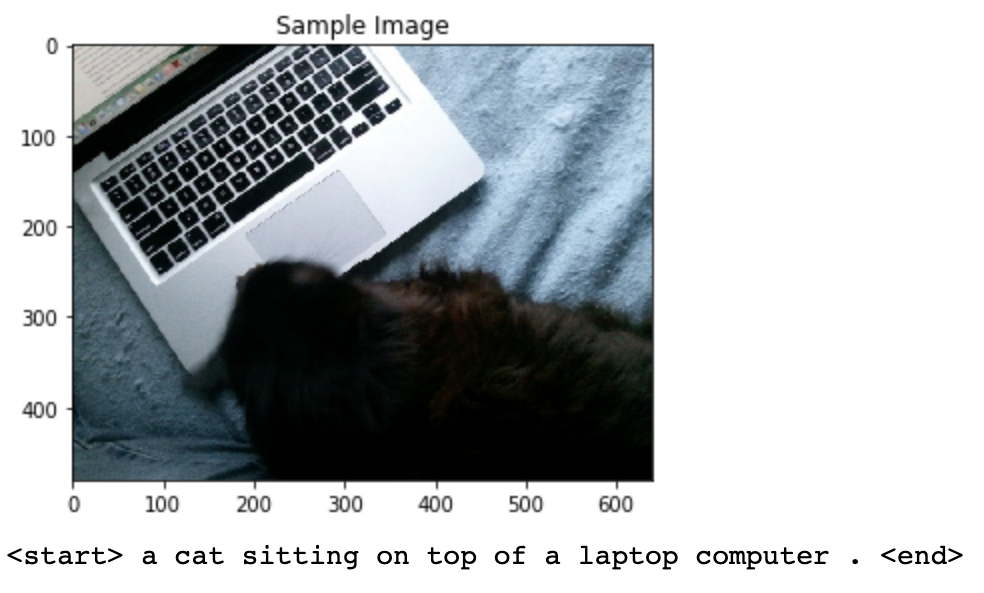

# Image Captioning Project
## Introduction
The repository contains a neural network, which can automatically generate captions from images. 

## Network Architecture
The solution architecture consists of:
1. CNN encoder, which encodes the images into the embedded feature vectors:

  

2. Decoder, which is a sequential neural network consisting of LSTM units, which translates the feature vector into a sequence of tokens:

  

## Results
These are some of the outputs give by the network using the [COCO dataset](http://cocodataset.org/):

  

  

